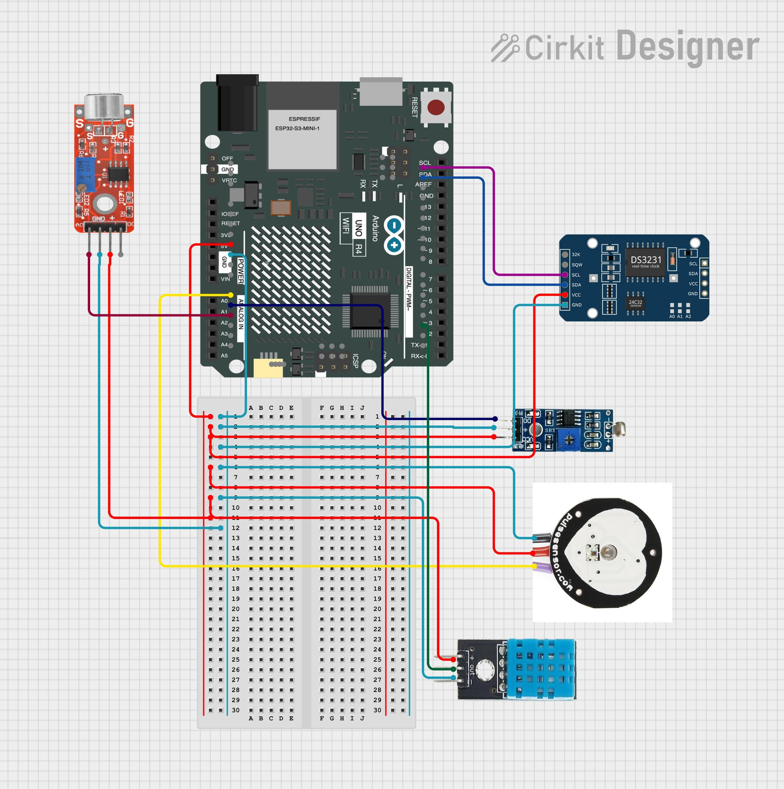

# IoT_Sleep_Tracker
IoT Sleep Tracker project for Software Engineering at York St John University
## Overview
For the development of this project we used the following physical components

|Component       |Purpose                         |
|----------------|--------------------------------|
|Arduino uno wifi|`Base mainboard`                |
|Pulse Sensor    |`Track heart rate`              |
|DHT11           |`Track temperature and humidity`|
|KY-037          |`Ambient Noise tracking`        |
|Light Sensor    |`Ambient Light trackign`        |
|DS3231 RTC      |`Real Time tracking`            |

## Model

